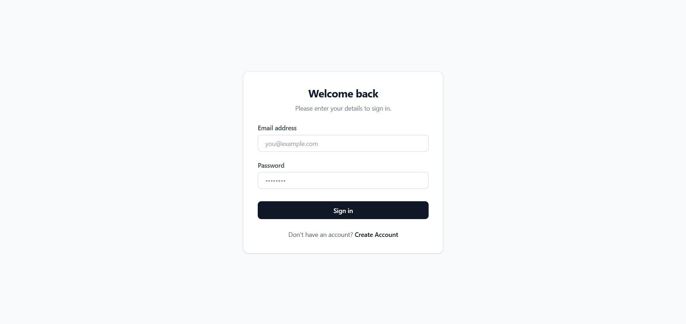
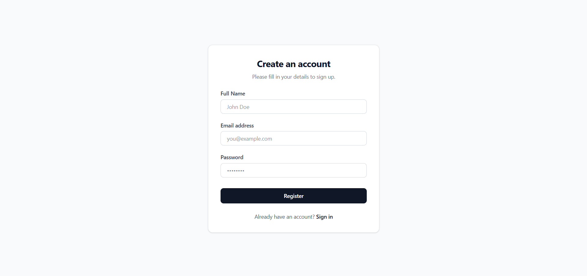
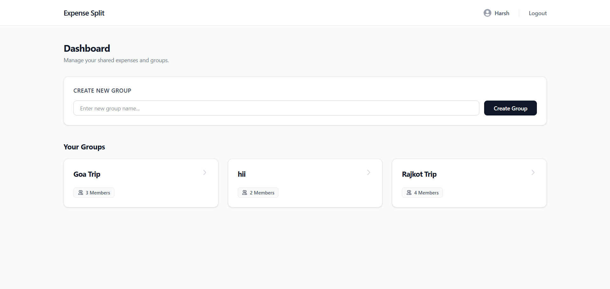
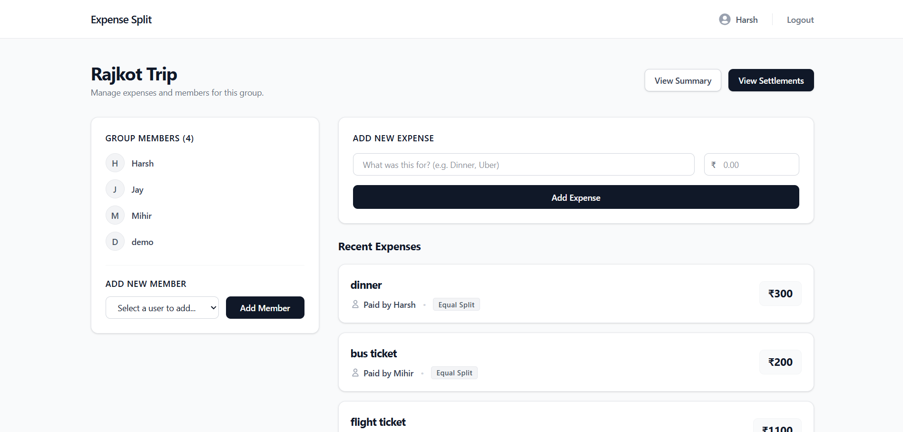
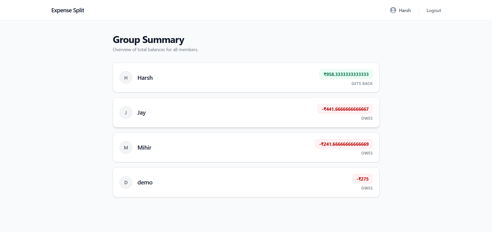
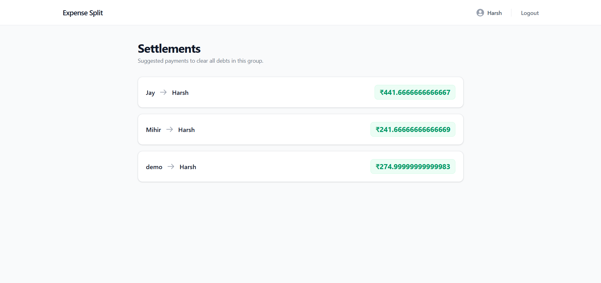

# Expense Split & Settlement System

A full-stack MERN-style application that allows users to create groups, manage shared expenses, calculate balances, and generate optimized settlement suggestions.

---

# Project Overview

Managing shared expenses manually becomes difficult when multiple people contribute to a group activity such as trips, parties, hostel expenses, or team events.

This application simplifies expense tracking by allowing users to:

* Create groups
* Add members
* Record expenses
* Split expenses equally
* View member balances
* Generate settlement suggestions

---

# Key Features

## Authentication

* User Registration
* User Login
* Password Hashing using bcryptjs
* JWT-based Authentication
* Protected API Routes

## Group Management

* Create Group
* View Groups
* View Group Details
* Add Members to Existing Groups

## Expense Management

* Add Expenses
* View Expense History
* Track Expense Descriptions
* Track Expense Payer

## Balance Summary

Automatically calculates each member's net balance.

Example:

Harsh paid ₹300 for a group of 3 members.

Result:

* Harsh → +₹200
* Mihir → -₹100
* Jay → -₹100

## Settlement Suggestions

Generate the minimum transactions required to settle all balances.

Example:

* Mihir pays Harsh ₹100
* Jay pays Harsh ₹100

---

# Tech Stack

## Frontend

* React.js
* React Router DOM
* Redux Toolkit
* Axios
* Tailwind CSS
* React Icons
* Sonner

## Backend

* Node.js
* Express.js
* MongoDB
* Mongoose
* JWT
* bcryptjs

---

# System Architecture

Frontend (React)

↓

REST APIs

↓

Backend (Node + Express)

↓

MongoDB Database

---

# Database Schema

## User

```js
{
  id,
  name,
  email,
  passwordHash
}
```

## Group

```js
{
  id,
  name,
  members:[]
}
```

## Expense

```js
{
  id,
  groupId,
  paidBy,
  amount,
  splitAmong[],
  description,
  createdAt
}
```

---

# Project Structure

```text
expense-split-system/

├── backend/
│
│   ├── config/
│   ├── controllers/
│   ├── middleware/
│   ├── models/
│   ├── routes/
│   ├── utils/
│   ├── .env
│   └── index.js
│
├── frontend/
│
│   ├── src/
│   │
│   │   ├── api/
│   │   ├── app/
│   │   ├── components/
│   │   ├── features/
│   │   ├── pages/
│   │   ├── routes/
│   │   └── App.jsx
│
├── screenshots/
│
└── README.md
```

---

# Screenshots

## Login Page

(Add Screenshot Here)



## Register Page

(Add Screenshot Here)




## Dashboard

(Add Screenshot Here)



## Group Details

(Add Screenshot Here)



## Summary Page

(Add Screenshot Here)



## Settlement Page

(Add Screenshot Here)




# Installation

## Clone Repository

```bash
git clone "https://github.com/HaRsHRaDaDiYa97/mini-expense-split-system.git"
```

---

## Backend Setup

```bash
cd backend

npm install

npm run dev
```

---

## Frontend Setup

```bash
cd frontend

npm install

npm run dev
```

---

# API Endpoints

## Authentication

POST /api/auth/register

POST /api/auth/login

GET /api/auth/users

---

## Groups

POST /api/groups

GET /api/groups

GET /api/groups/:id

PUT /api/groups/:id/add-member

---

## Expenses

POST /api/groups/:id/expenses

GET /api/groups/:id/expenses

---

## Summary

GET /api/groups/:id/summary

---

## Settlements

GET /api/groups/:id/settlements

---

# Sample Test Scenario

Users:

* Harsh
* Mihir
* Jay

Group:

* Rajkot Trip

Expense:

* Lunch ₹300
* Paid By Harsh

Summary:

* Harsh +₹200
* Mihir -₹100
* Jay -₹100

Settlement:

* Mihir → Harsh ₹100
* Jay → Harsh ₹100

---

# Future Improvements

* Unequal Expense Split
* Expense Editing
* Expense Deletion
* Email Invitations
* Real-Time Updates
* Multi-Currency Support
* Expense Categories
* Settlement History

---

# Author

Harsh Radadiya

